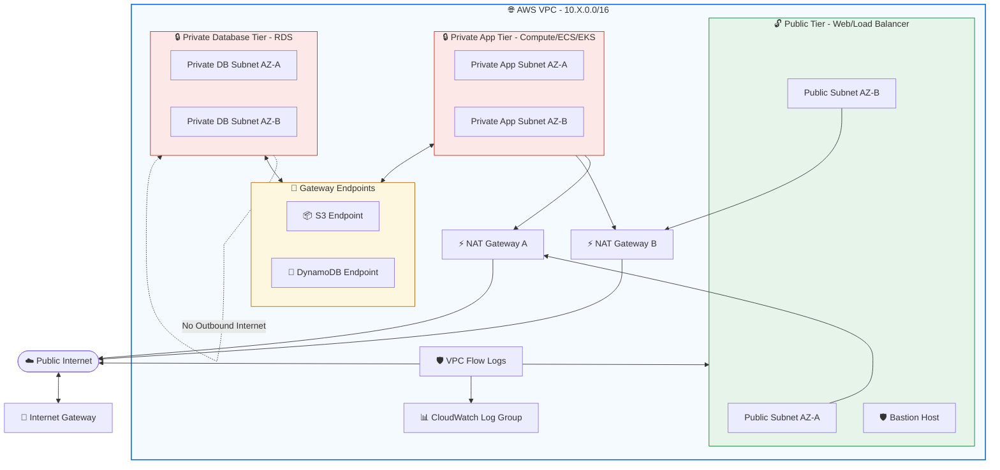
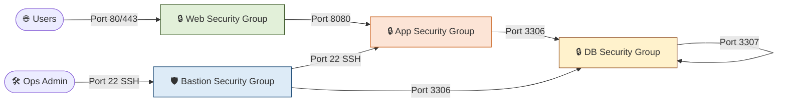

# 🌐 Production-Grade Multi-Environment AWS VPC Infrastructure

[](https://www.terraform.io/)
[](https://registry.terraform.io/providers/hashicorp/aws/latest)
[](https://opensource.org/licenses/MIT)

A robust, enterprise-grade **AWS Virtual Private Cloud (VPC)** architecture designed using **Terraform**. This project establishes a secure, highly available, and isolated networking foundation across multiple environments (**Development**, **Staging**, and **Production**) following the best practices of the AWS Well-Architected Framework.

---

## 🏗️ Architectural Overview

This infrastructure employs a **Three-Tier Subnet Architecture** designed to isolate resources based on exposure and security requirements:



### Key Architectural Highlights:
1. **Three-Tier Isolation**:
   * **Public Subnets**: Directly exposed to the internet. Hosts Web servers, ALBs, and Bastion hosts. Mapped with `map_public_ip_on_launch = true`.
   * **Private App Subnets**: Fully internal network tier for application engines (EC2 instances, ECS tasks, EKS pods). Outbound internet connectivity is enabled through NAT Gateways.
   * **Private DB Subnets**: Heavily isolated tier reserved exclusively for databases (RDS/Aurora clusters). **No outbound or inbound internet routing allowed**.
2. **Environment-Aware High Availability**:
   * **Production (`prod`)**: deploys **Multi-AZ NAT Gateways** (one per Availability Zone) to avoid single points of failure.
   * **Development (`dev`) & Staging (`staging`)**: shares a **single NAT Gateway** across all zones to keep running costs optimized.
3. **Advanced Security Controls**:
   * Strict security groups implementing **Least Privilege** access patterns (Web ➔ App ➔ DB).
   * Optional **VPC Flow Logs** automatically configured with environment-specific log retention periods in Amazon CloudWatch.
   * Internal **S3 & DynamoDB Gateway Endpoints** keeping traffic for these services within the AWS backbone, bypassing NAT Gateways and saving data transfer costs.

---

## 📁 Repository Structure

The project has been organized modularly to enable maximum reuse and strict separation of configuration for different deployment environments.

```text
terraform-aws-vpc/
├── .github/                 # CI/CD Workflows
├── environments/            # Environment-specific configurations
│   ├── dev/                 # Development environment settings
│   │   ├── backend.tf       # Remote backend configuration for Dev
│   │   ├── main.tf          # dev module instantiation
│   │   ├── outputs.tf       # dev outputs mapping
│   │   ├── terraform.tfvars # Dev environment input values
│   │   └── variables.tf     # Dev environment variables declaration
│   ├── staging/             # Staging environment settings
│   └── prod/                # Production environment settings
├── global/                  # Global shared assets
│   └── iam/
│       └── terraform-backend-policy.json # Minimized IAM Policy for TF S3 state & Lock
├── modules/                 # Modular re-usable Terraform blocks
│   └── vpc/                 # Main VPC Module
│       ├── endpoints.tf       # S3/DynamoDB Gateway endpoints configuration
│       ├── flow-logs.tf       # CloudWatch logging and IAM setup for VPC flow logs
│       ├── igw.tf             # Internet Gateway resource
│       ├── locals.tf          # Dynamic module calculations (NAT GW count, retention)
│       ├── main.tf            # Module provider and tag definitions
│       ├── natgw.tf           # Elastic IPs and NAT Gateways logic
│       ├── outputs.tf         # Module outputs
│       ├── routing-tables.tf  # Route tables & association mappings for all subnets
│       ├── security-groups.tf # Tiered Security Groups definitions (Web, App, DB, Bastion)
│       ├── subnets.tf         # IP Subnets assignments across AZs
│       └── variables.tf       # Declared VPC variables and options
├── scripts/                 # Bash helper utilities
│   ├── deploy-env.sh        # Performs complete init -> plan -> apply pipeline
│   ├── destroy-env.sh       # Safely tears down environments
│   ├── init-env.sh          # Handles workspace initialization & formatting
│   ├── make.sh              # Wrapper for execution environments
│   └── s3DynamoDB.sh        # Automates creation of Remote S3 state buckets and Lock tables
├── Makefile                 # Make command short-cuts for local developers
├── scriptstart.sh           # Bootstrap script to mock structure creation
└── deploy.sh                # Main deploy script for executing deployments sequentially
```

---

## 📊 Environment Configuration Matrices

| Configuration Feature | Development (`dev`) | Staging (`staging`) | Production (`prod`) |
| :--- | :--- | :--- | :--- |
| **VPC CIDR Block** | `10.0.0.0/16` | `10.1.0.0/16` | `10.2.0.0/16` |
| **Availability Zones** | 2 (`us-east-1a`, `1b`) | 3 (`us-east-1a`, `1b`, `1c`) | 3 (`us-east-1a`, `1b`, `1c`) |
| **NAT Gateways** | **1** (Cost-optimized) | **1** (Cost-optimized) | **3** (1 per AZ - HA) |
| **Bastion Host Enabled** | ❌ Disabled (`false`) |  Enabled (`true`) |  Enabled (`true`) |
| **VPC Flow Logs** |  Enabled (30 days) |  Enabled (90 days) |  Enabled (365 days) |
| **Gateway Endpoints** | S3 & DynamoDB | S3 & DynamoDB | S3 & DynamoDB |

---

## 🛠️ Getting Started & Deployment

### 📋 Prerequisites
* [Terraform v1.0+](https://developer.hashicorp.com/terraform/downloads) installed locally.
* [AWS CLI v2](https://docs.aws.amazon.com/cli/latest/userguide/getting-started-install.html) installed and configured with appropriate permissions.
* A configured AWS Profile or AWS Environment Variables:
  ```bash
  export AWS_ACCESS_KEY_ID="your_access_key"
  export AWS_SECRET_ACCESS_KEY="your_secret_key"
  export AWS_DEFAULT_REGION="us-east-1"
  ```

---

### 1️⃣ Bootstrap Remote Backend (Optional but Recommended)
Before executing Terraform deployments, initialize the remote S3 State Buckets and DynamoDB State-Locking tables using the provided helper script:

```bash
chmod +x scripts/s3DynamoDB.sh
./scripts/s3DynamoDB.sh
```

This creates the following infrastructure in your AWS account:
* S3 Buckets with versioning and server-side encryption:
  * `myapp01-terraform-state-dev`
  * `myapp01-terraform-state-staging`
  * `myapp01-terraform-state-prod`
* DynamoDB Tables with `LockID` hash key:
  * `myapp01-terraform-locks-dev` (and corresponding staging/prod tables)

---

### 2️⃣ Deployment Execution

#### 🚀 Option A: Using the `Makefile` (Recommended)
This repository includes a comprehensive `Makefile` to simplify local operations across environments.

```bash
# Display help and available commands
make help

# 1. Initialize and deploy the Development environment
make init-dev
make plan-dev
make dev          # Deploys with -auto-approve

# 2. Inspect the outputs
make output-dev

# 3. Format and lint Terraform files recursively
make fmt

# 4. Clean local caches
make clean
```

#### 🐚 Option B: Using Helper Bash Scripts
If running on systems where `make` is unavailable, you can use the standard deploy shell scripts:

```bash
# Initialize and validate dev
./scripts/init-env.sh dev

# Deploy environment with auto-approval
./scripts/deploy-env.sh dev true

# To deploy staging and production:
./scripts/deploy-env.sh staging true
./scripts/deploy-env.sh prod true
```

---

## 🛡️ Security Architecture & Traffic Flow

The VPC uses strict subnet isolation via local security group rules. Traffic flow is strictly structured using the **Least Privilege** model:



* **Web Tier Security Group (`web-sg`)**:
  * Ingress: HTTP (`80`) & HTTPS (`443`) from anywhere (`0.0.0.0/0`).
  * Ingress: SSH (`22`) restricted to IPs defined in `allowed_ssh_cidrs`.
* **App Tier Security Group (`app-sg`)**:
  * Ingress: App Port (`var.app_port`) strictly allowed **only** from the `web-sg` security group ID.
  * Ingress: SSH (`22`) strictly allowed **only** from `web-sg`.
  * Ingress: Metrics Port (`9090`) restricted to internal monitoring networks.
* **Database Tier Security Group (`db-sg`)**:
  * Ingress: DB Port (`3306`) strictly allowed **only** from the `app-sg` security group ID.
  * Ingress: DB Replication Port (`3307`) allowed from other instances in the database security group.
  * Ingress: DB Admin Port (`var.db_admin_port`) allowed from `bastion-sg`.

---

## ⚙️ Module Customization

### Inputs Reference (`variables.tf` in `/modules/vpc`)

| Name | Description | Type | Default | Required |
| :--- | :--- | :--- | :--- | :--- |
| `environment` | Environment name (`dev`, `staging`, `prod`) | `string` | — | **Yes** |
| `aws_region` | AWS region to deploy infrastructure | `string` | — | **Yes** |
| `vpc_cidr` | CIDR block for the VPC | `string` | — | **Yes** |
| `public_subnet_cidrs` | List of CIDR blocks for public subnets | `list(string)` | — | **Yes** |
| `private_app_subnet_cidrs` | List of CIDR blocks for private app subnets | `list(string)` | — | **Yes** |
| `private_db_subnet_cidrs` | List of CIDR blocks for private db subnets | `list(string)` | — | **Yes** |
| `availability_zones` | List of target Availability Zones | `list(string)` | — | **Yes** |
| `enable_bastion` | Toggle provisioning of Bastion SG rules | `bool` | `false` | No |
| `enable_flow_logs` | Enable VPC Flow Logs to CloudWatch Group | `bool` | `true` | No |
| `enable_s3_endpoint` | Provision Gateway Endpoint for S3 routing | `bool` | `true` | No |
| `enable_dynamodb_endpoint` | Provision Gateway Endpoint for DynamoDB routing | `bool` | `true` | No |

### Outputs Reference (`outputs.tf` in `/modules/vpc`)

| Name | Description | Example Output |
| :--- | :--- | :--- |
| `vpc_id` | Unique ID of the created VPC | `vpc-01ab23cd45ef` |
| `public_subnet_ids` | List of IDs of the public subnets | `["subnet-1234", "subnet-5678"]` |
| `private_app_subnet_ids` | List of IDs of the private app subnets | `["subnet-9876", "subnet-5432"]` |
| `private_db_subnet_ids` | List of IDs of the private db subnets | `["subnet-4321", "subnet-8765"]` |
| `web_sg_id` | Security Group ID of the Web Tier | `sg-0abc123def456` |
| `app_sg_id` | Security Group ID of the App Tier | `sg-0def456abc123` |
| `db_sg_id` | Security Group ID of the Database Tier | `sg-0789xyzabc123` |
| `nat_public_ips` | Allocated EIPs of the NAT Gateways | `["54.123.45.67", "54.123.45.68"]` |

---

## 🗑️ Tear Down and Clean up
To cleanly destroy infrastructure to prevent ongoing AWS billing:

```bash
# Using Makefile
make destroy-dev
make destroy-staging
make destroy-prod

# Or using Shell scripts
./scripts/destroy-env.sh dev true
```

---

> [!NOTE]
> All resources are tagged dynamically with standard metadata including `Environment`, `Project`, `ManagedBy = Terraform`, `Region`, and a `RandomSuffix` to ensure easy cost tracking and asset visibility within the AWS Management Console.
